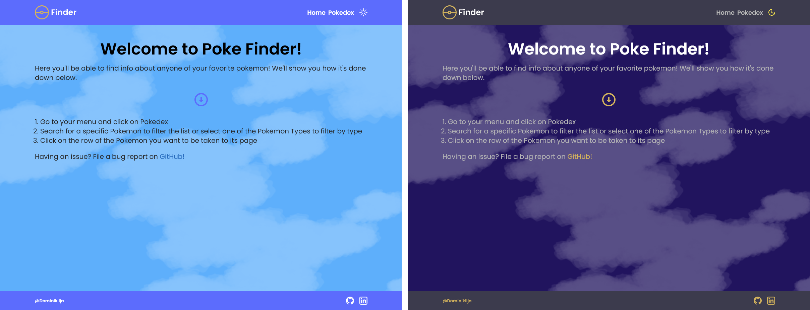
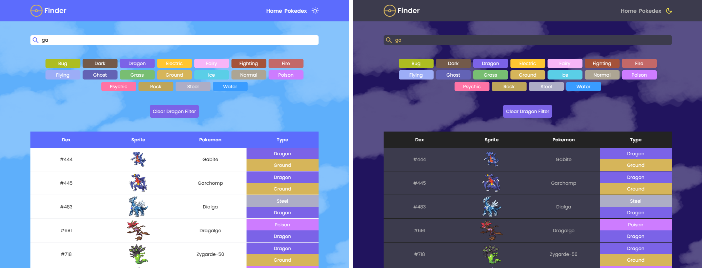
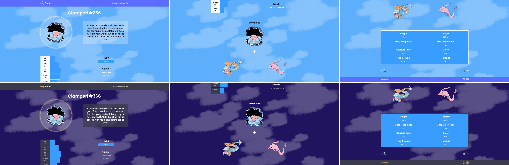
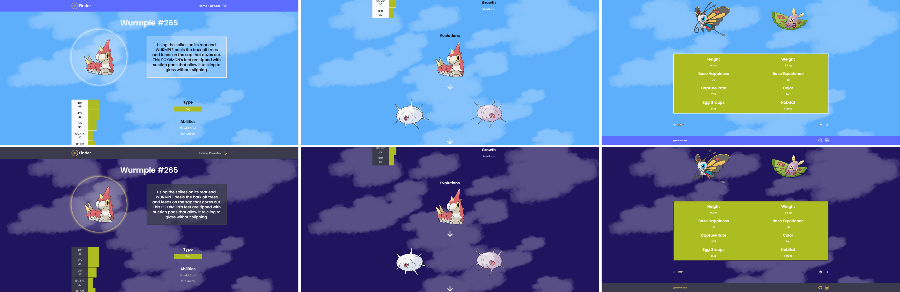
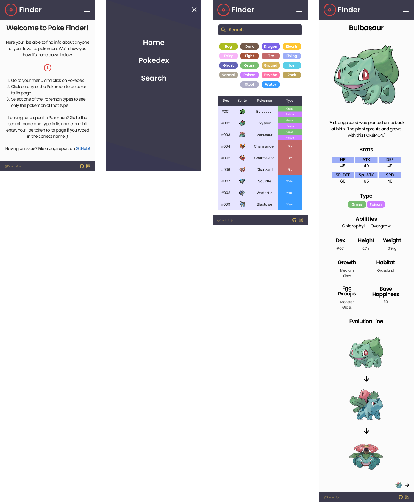
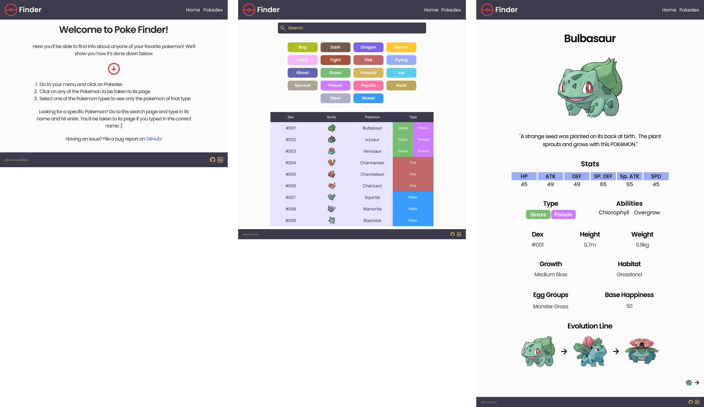
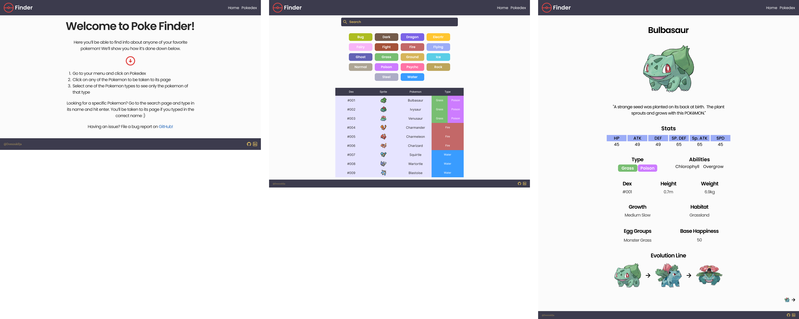

# Poke Finder

Visit the website : [Poke Finder](https://poke-finder-ilja.netlify.app/) 

## Description
Poke Finder allows you to search for any of the 905 available Pokemon! This is done by accessing Pokemon information available through the free to use [Poke API](https://pokeapi.co/])! You'll be able to see any of your favorite Pokemon in our beautiful light or dark modes. Enjoy!

### Searching
Searching is done on the **Pokedex** page. 

On this page we can search our list of Pokemon by typing into our search bar. This will update our list in real time allowing you to see all the matches of your search. But wait, there's more! We have another layer of filtering that will only show a Pokemon of a specific type. This is done by selecting any one of the 18 Pokemon types below our search bar.

Yes, these two types of filters do work in unison. You can filter by type then get even more specific by using the search bar.

### Selecting Pokemon
Once you've found the Pokemon you want, simply click on the list item and you'll be taken to its page. Every page is dynamically rendered using React Router. On this page we're able to see more information about our pokemon such as: evolution line, stats, description, etc.

If you wish to see the next or previous Pokedex entries, at the bottom of the page are links that'll take you to those pages.

## MVP
Needed app featuers :

1. Homepage that describes how to use the app
2. A page that allows a user to filter the list of available Pokemon
3. The ability to dynamically render information about any Pokemon a user selects

## Post-MVP
Some stretch goals :

1. Light & dark mode
2. Hamburger menu for mobile displays
3. Storing Pokemon information in state to prevent unneccessary data fetching

## App Images

## Component Hierarchy

## Original Wireframes

### Mobile

### Tablet

### Desktop

